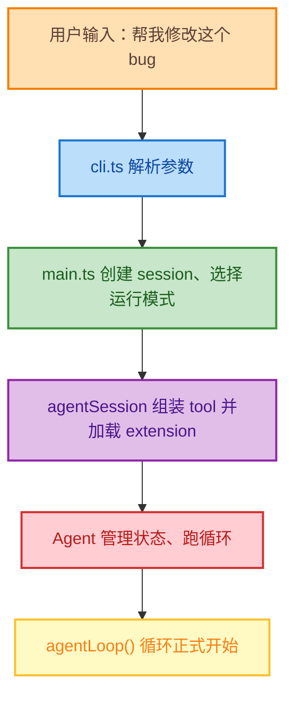
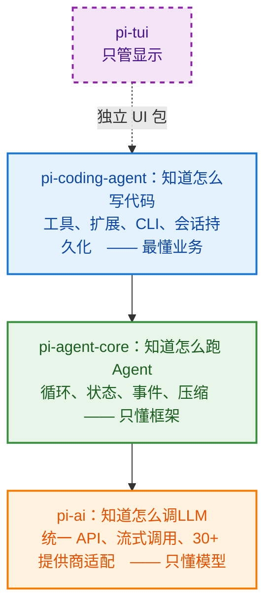
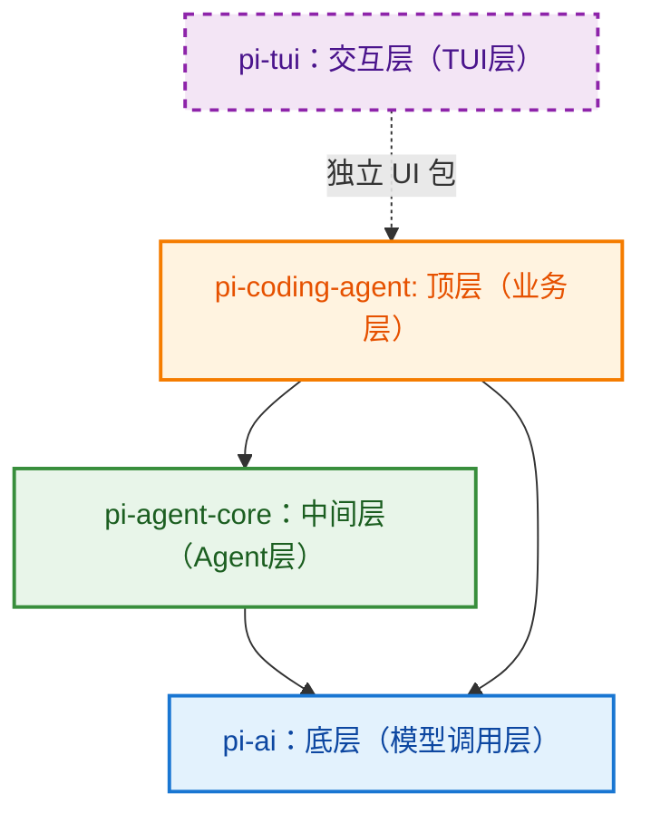
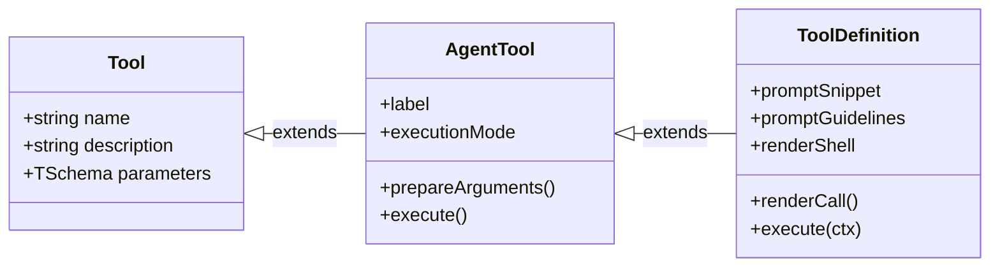

# pi 的核心组件与架构总览
最近在研究harness engineering，同时也注意到了 pi 这个 agent 项目，其极简、轻量、不臃肿特点，值得在工作之余抽空研究一下，同时它也可以作为harness engineering的一个典范教材，也吸收一下开源社区的优秀设计，融入到自己的工作的项目设计中。

系列第一章，先从架构总览讲起吧。

## 1. pi-ai
> "Unified LLM API with automatic model discovery and provider configuration."
LLM多厂商注册，统一定义类型与流式调用。主要负责调用各种不同的LLM。
可以认为pi-ai是一个将各家LLM厂商的API进行统一封装以消除提供商 SDK 切换，提供统一编程接口，也可以对接真正的LLM网关。


## 2. pi-agent-core
> "General-purpose agent with transport abstraction, state management, and attachment support."
> 通用Agent，提供传输抽象、状态管理、附件支持等功能。
agent-core仅关心4个维度：
1. 维护对话状态， AgentState（state management）
2. 跑一个agentLoop：LLM调用->执行工具->LLM调用
3. 在agentLoop中发送AgentEvent与外部通信以了解状态（transport abstraction）
4. 管理Session、compact
即如何让LLM形成一个思考->行动->思考的agentLoop。


## 3. pi-coding-agent
> "Coding agent cli with read, bash, edit, write tools, and session management."
> 编码Agent cli，提供read、bash、edit、write等工具和会话管理功能。 

agent-core中只关心如何跑agentLoop，不会进行 read, bash, edit, write等操作，而些操作均由 coding-agent执行。
coding-agent主要掌管以下具体的功能：
- read, bash, edit, write, grep, find, ls 等coding工具及其实现方式
- extension 的管理、加载
- session 的持久化保持
- cli 解析参数、在TUI渲染输出的方式
- 认证信息存储方式

整条[链路](#chain)如下：
<a id = "chain"></a>




## 4. pi 的架构 
根据前三章的内容，从直觉上 pi 的简单[架构图](#architect)如下：

<a id = "architect"></a>



从这个直觉的架构图中，可认为 coding-agent 依赖于 agent-core，但根据 [依赖关系](#dep-json) 中的 [`packages/coding-agent/package.json`](#dep-json)：
<a id="dep-json"></a>

```jsonc
// packages/coding-agent/package.json
"dependences": {
    "@earendil-works/pi-agent-core":"^@version",
    "@earendil-works/pi-ai":"^@version",
    "@earendil-works/pi-tui":"^@version",
    ... // 其余依赖
}
```
可以看出 pi-coding-agent 也直接依赖了 pi-ai这个底层，而非通过 pi-agent-core 间接调用 pi-ai，难道是依赖出现了错误？

[`packages/agent/src/types.ts`](#type-agent)给出了答案：
<a id="type-agent"></a>

```ts
// packages/agent/src/types.ts
import type {
    Api,
    ...
    Context,
    ImageContent,
    Message,
    Model,
    SimpleStreamOptions,
    TextContent,
    Tool,
    ToolResultMessage,
} from "@earendil-works/pi-ai";
```

pi-agent-core 中很多重要的基础类型（Tool, Message, Model等）均从 pi-ai 导入，这些基础类型可以认为是原子类型，在 pi-ai 这个底层中统一定义，无论 pi-coding-agent 多么远离 pi-ai 这一底层，对其中的原子类型的引用、依赖都是必然。

但这不代表之前分层依赖的架构图是完全错误的，由 [pi-ai](#dep-ai) 、 [pi-agent-core](#dep-core) 的依赖：

<a id = "dep-ai">

```jsonc
// packages/agent/package.json
"dependences": {
    "@earendil-works/pi-ai":"^@version",
    "typebox":"@version",
    "yaml":"@version"
    ... // 其余依赖
}
```
<a id = "dep-core">

```jsonc
// packages/ai/package.json
"dependencies": {
    "@anthropic-ai/sdk": "@version",
    "@aws-sdk/client-bedrock-runtime": "@version",
    "@earendil-works/pi-telemetry": "^@version",
    "@google/genai": "@version",
    ... // 其余依赖
}
```

可知对应的dependences里均为单向依赖，不存在反向依赖，因此[下图](#new_archi)更符合实际的情况：
<a id = "new_archi">



## 5. 类型在各层的流转：

### pi-ai的基础类型定义

从[`packages/agent/src/types.ts`](#type-agent)可知， 许多基础的类型的定义出现在 pi-ai 层;
在[`packages/ai/src/types.ts`](#type-ai) 中有三个最重要的基础类型定义： `Message`, `Model`, `Tool`，这是与LLM互动无法脱离三种基础类型。
<a id = "type-ai">

```ts
// packages/ai/src/types.ts
type Message = UserMessage | AssistantMessage | ToolResultMessage

interface Model<TApi> {
    id: string
    name: string
    api: Api
    contextWindow: number
    // ...
}

interface Tool<TSchema> {
    name: string
    description: string
    parameters: TSchema
}
```

### pi-agent-core对pi-ai的扩展

pi-agent-core 中 **[`packages/agent/src/types.ts`](#type-ext)** 又将此三类**基础类型**进行扩展
<a id = "type-ext">

```ts
// packages/agent/src/types.ts
import type {
    Message, Model, Tool, ImageContent, ...
} from "@earendil-works/pi-ai";

type AgentMessage = Message | CustomAgentMessages[keyof CustomAgentMessages]

interface AgentTool<TParameters extends TSchema = TSchema, TDetails = any> extends Tool<TParameters> {
    label: string                                    
    prepareArguments?: (args: unknown) => Static<TParameters> 
    execute: (toolCallId: string, params, signal?: AbortSignal, onUpdate?: AgentToolUpdateCallback<TDetails>) => Promise<AgentToolResult<TDetails>>
    executionMode?: ToolExecutionMode // "sequential" | "parallel" 
}
```

由[`packages/agent/src/types.ts`](#type-ext)可知：
1. `AgentMessage`在`Message`的基础上扩展了**自定义消息(CustomAgentMessages)**，如压缩摘要、分支信息，这种扩展的实现使用TS联合类型 (`|`)的特性，不会修改原先的类型定义；
2. `AgentTool`对`Tool`进行继承，底层`Tool`只让LLM知道工具名称、参数、描述, 而`AgentTool`在此基础上扩展出详细信息（TDetails）：参数校验（prepareArguments）、执行函数（含调用id、取消信号、流式进度报告）、执行模式（串行/并行）

### pi-coding-agent 对 pi-agent-core 的扩展类型进一步封装

pi-coding-agent 中会将 pi-agent-core 的扩展类型封装为具体的 **[业务定义](#definition)**
<a id = "definition">

```ts
// packages/coding-agent/src/core/extensions/types.ts

interface ToolDefinition<TParams extends TSchema, TDetails = unknown, TState = any> {
    name: string
    label: string                         // UI 展示名
    description: string
    promptSnippet?: string                // 自动拼到 system prompt 的工具片段
    promptGuidelines?: string[]           // 工具使用守则
    parameters: TParams
    renderShell?: "default" | "self"      // 渲染模式
    prepareArguments?: (args: unknown) => Static<TParams>   // 参数预处理钩子
    executionMode?: ToolExecutionMode     // "sequential" | "parallel" 
    execute: (toolCallId, params, signal, onUpdate, ctx: ExtensionContext) => Promise<AgentToolResult<TDetails>>  // 签名扩展：比 AgentTool.execute 多 ctx 参数
    renderCall?: ...                      // 自定义调用渲染
    // ...
}

interface Extension {
    path: string                                       // 扩展路径
    resolvedPath: string                               // 解析后的绝对路径
    sourceInfo: SourceInfo                             // 来源信息
    handlers: Map<string, HandlerFn[]>                 // 各类处理器
    tools: Map<string, RegisteredTool>                 // 注册的工具（Map，非 Record）
    messageRenderers: Map<string, MessageRenderer>     // 消息渲染器
    commands: Map<string, RegisteredCommand>           // 注册的命令（Map，非 Record）
    flags: Map<string, ExtensionFlag>                  // 扩展标志
    shortcuts: Map<KeyId, ExtensionShortcut>           // 快捷键绑定
}
```
由[`packages/coding-agent/src/core/extensions/types.ts`](#definition)可知：工具定义`ToolDefinition`对`AgentTool`进行了解耦化的结构兼容而非使用`extends`继承，对原先的AgentTool添加对应的字段以及更改`execute`签名，这样的改动不会影响上游`AgentTool`。反之，`AgentTool`的改动也不会影响到`ToolDefinition`


pi从底层定义最小类型，到中间层对底层继承，再到顶层对中间层的结构兼容。底层既有的能力可供上层扩展，每层只添加本层需要关心的字段，不对原有的下层进行任何修改。底层LLM关心工具长什么样，中间层Agent关心工具如何执行，顶层业务关心如何显示。 

三层间层层递进的关系可以抽象为[下图](#3layer)：
<a id = "3layer">



## 6. 简单的案例体现Harness架构

pi的三层结构，本质是把"一个工具"在 Agent 系统中的三种角色——协议对象、执行单元、产品单元——分别建模，并用"底层继承、上层结构兼容"的方式解耦，使每层独立演进。这正是 Agent Harness 的核心设计范式。

在对[工具定义](#definition)中，可以看到有以下几点：
### 1. `promptSnippet` / `promptGuidelines` 
`promptSnippet` 是注册工具自带的prompt片段，工具的注册意味着prompt的注入，这便是体现harness的**动态prompt编排**。在这里，harness替开发者做prompt工程，而非开发者自己手写system prompt。

### 2. `ExtensionContext`
工具在运行时能够获取上下文（如工作目录、会话、其他扩展等），harness成为**Extension**之间的协作连接器，不会让工具之间互相import，**这是harness的能力总线**。

### 3. `executionMode`
串行/并行的执行模式不由工具本身自己决定，而是给harness声明意图，**harness掌管工具的调度权**，而工具本身保持纯粹。

### 4. `Extension`中的`Map`类型
`handler` `tools`等均使用`Map`类型，可自由注册、卸载、覆盖、迭代，体现出**harness的运行时可变性**，即**动态扩展生态+信任分级**，这是harness这个platform的infrastructure。


harness 的本质不是"写一个 Agent 循环"，而是：
- **定义清晰的分层契约（模型看什么 / 运行时怎么跑 / 人怎么看）**
- **在层间做正确的耦合选择（该继承的继承，该兼容的兼容）**
- **把编排权、调度权、呈现权收归框架，让工具保持纯粹**