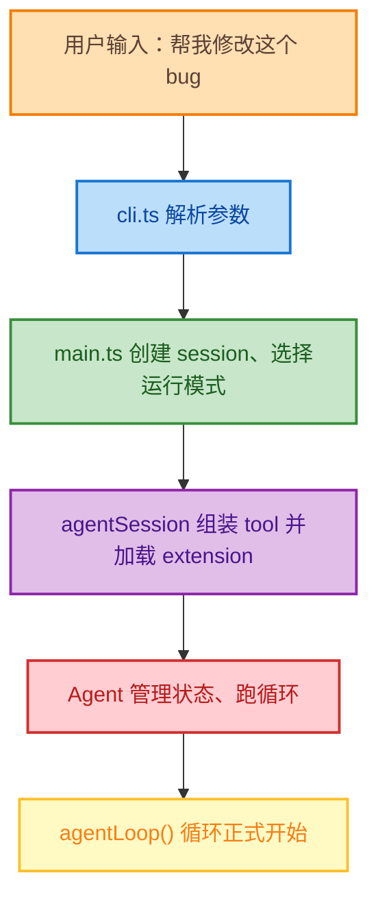
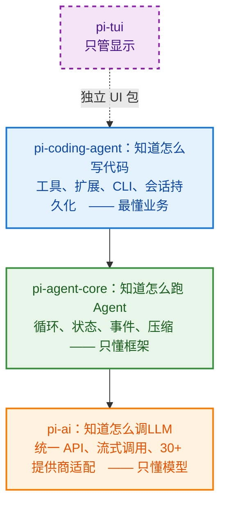
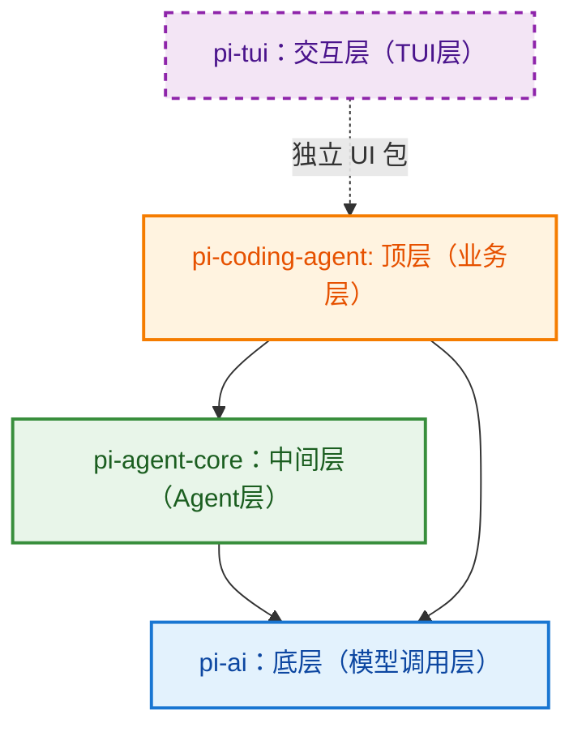

# pi 的核心组件与架构总览
最近在研究harness engineering，同时也注意到了 pi 这个 agent 项目，其极简、轻量、不臃肿特点，值得在工作之余抽空研究一下，同时它也可以作为harness engineering的一个典范教材，也吸收一下开源社区的优秀设计，融入到自己的工作的项目设计中。

系列第一章，先从架构总览讲起吧。

## 1. pi-ai
> "Unified LLM API with automatic model discovery and provider configuration."
LLM多厂商注册，统一定义类型与流式调用。主要负责调用各种不同的LLM。
可以认为pi-ai是一个将各家LLM厂商的API进行统一封装以消除提供商 SDK 切换，提供统一编程接口，也可以对接真正的LLM网关。


## 2. pi-agent-core
> "General-purpose agent with transport abstraction, state management, and attachment support."
> 通用Agent，提供传输抽象、状态管理、附件支持等功能。
agent-core仅关心4个维度：
1. 维护对话状态， AgentState（state management）
2. 跑一个agentLoop：LLM调用->执行工具->LLM调用
3. 在agentLoop中发送AgentEvent与外部通信以了解状态（transport abstraction）
4. 管理Session、compact
即如何让LLM形成一个思考->行动->思考的agentLoop。


## 3. pi-coding-agent
> "Coding agent cli with read, bash, edit, write tools, and session management."
> 编码Agent cli，提供read、bash、edit、write等工具和会话管理功能。 

agent-core中只关心如何跑agentLoop，不会进行 read, bash, edit, write等操作，而些操作均由 coding-agent执行。
coding-agent主要掌管以下具体的功能：
- read, bash, edit, write, grep, find, ls 等coding工具及其实现方式
- extension 的管理、加载
- session 的持久化保持
- cli 解析参数、在TUI渲染输出的方式
- 认证信息存储方式

整条链路如下：




## 4. pi 的架构 
根据前三章的内容，从直觉上 pi 的简单架构图如下：



从这个直觉的架构图中，可认为coding-agent依赖于agent-core，但根据 `packages/coding-agent/package.json` 中的依赖关系：
```json
// packages/coding-agent/package.json
"dependences": {
    "@earendil-works/pi-agent-core":"^@version",
    "@earendil-works/pi-ai":"^@version",
    "@earendil-works/pi-tui":"^@version",
    ... // 其余依赖
}
```
可以看出 pi-coding-agent 也直接依赖了 pi-ai这个底层，而非通过 pi-agent-core 间接调用 pi-ai，难道是依赖出现了错误？

`packages/agent/src/types.ts`给出了答案：
```ts
// packages/agent/src/types.ts
import type {
    Api,
    ...
    Context,
    ImageContent,
    Message,
    Model,
    SimpleStreamOptions,
    TextContent,
    Tool,
    ToolResultMessage,
} from "@earendil-works/pi-ai";
```

pi-agent-core 中很多重要的基础类型（Tool, Message, Model等）均从 pi-ai 导入，这些基础类型可以认为是原子类型，在 pi-ai 这个底层中统一定义，无论 pi-coding-agent 多么远离 pi-ai 这一底层，对其中的原子类型的引用、依赖都是必然。

但这不代表之前分层依赖的架构图是完全错误的，由 pi-ai 、 pi-agent-core 的依赖：

```json
// packages/agent/package.json
"dependences": {
    "@earendil-works/pi-ai":"^@version",
    "typebox":"@version",
    "yaml":"@version"
    ... // 其余依赖
}
```

```json
// packages/ai/package.json
"dependencies": {
    "@anthropic-ai/sdk": "@version",
    "@aws-sdk/client-bedrock-runtime": "@version",
    "@earendil-works/pi-telemetry": "^@version",
    "@google/genai": "@version",
    ... // 其余依赖
},
```

可知对应的dependences里均为单向依赖，不存在反向依赖，因此原先的架构图可进行一些修改：



## 5. 类型在各层的流转：
从前文可知